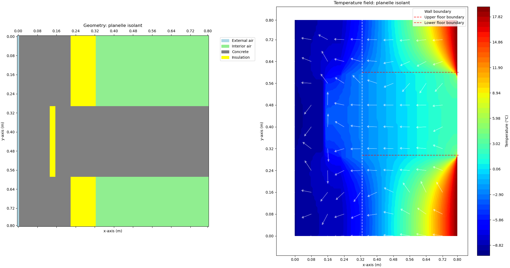
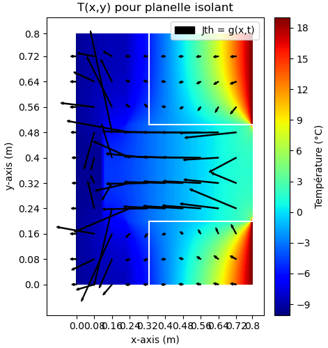

# Thermal Bridge Simulation

This project allows you to simulate and analyze thermal bridges in different wall and floor configurations. It uses the finite difference method and the Jacobi scheme to solve the 2D heat equation.

## Description

The project makes it possible to study different construction configurations to reduce thermal losses at wall/floor junctions:

-Simple wall with insulation

-Wall with a thermal break

-Wall with insulating facing brick

-Different insulation positions

## Features

2D steady-state thermal simulation

-Calculation of temperature fields

-Visualization of heat fluxes

-Calculation of the thermal bridge coefficient Ψ

-Estimation of energy losses

-Comparison of different construction solutions

## Code Structure

-main.py: Main program and simulation parameters

-geometrie.py: Definition of different geometric configurations

-fonction_calcul.py: Numerical calculation functions (Jacobi, gradients, etc.)

-fonction_therm.py: Thermal functions (boundary conditions, flux, etc.)

## Adjustable Parameters

-Geometric dimensions (thicknesses, heights, etc.)

-Material properties (thermal conductivities, etc.)

-Boundary conditions (indoor/outdoor temperatures)

-Numerical parameters (discretization, relaxation, etc.)

## Usage

-Define the parameters in main.py

-Choose a geometric configuration

-Run the simulation

-Visualize the results (temperature fields, fluxes)

-Analyze performance (Ψ coefficient, energy cost)

## Results

The program generates:

-A visualization of the geometry

  

-Temperature and heat flux fields

  

-The thermal bridge coefficient Ψ

-An estimate of energy losses

## Dependencies

-NumPy: Numerical calculations

-Matplotlib: Visualization of results